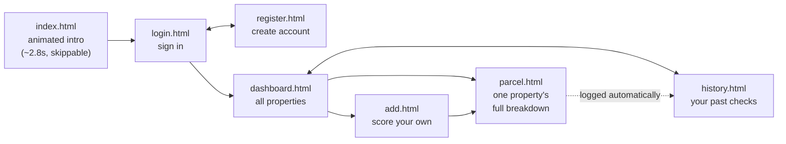
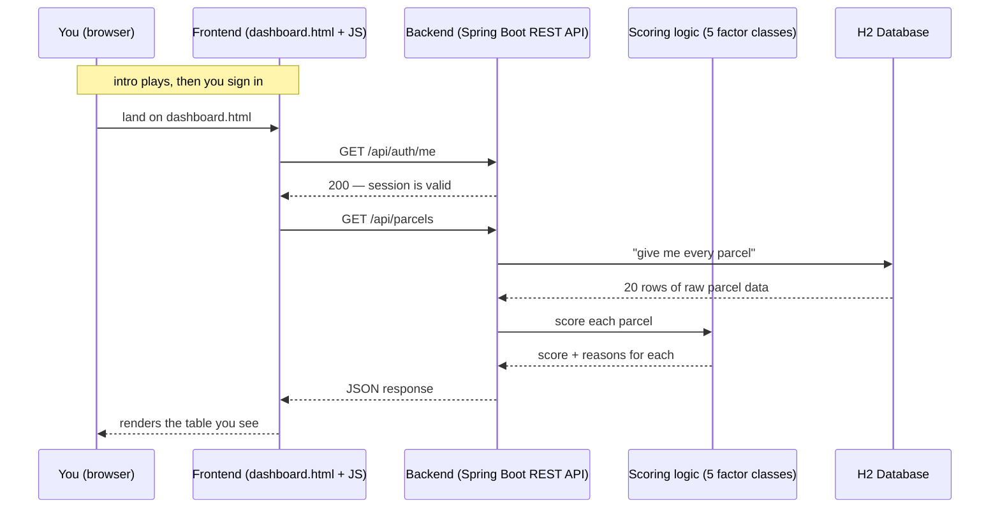
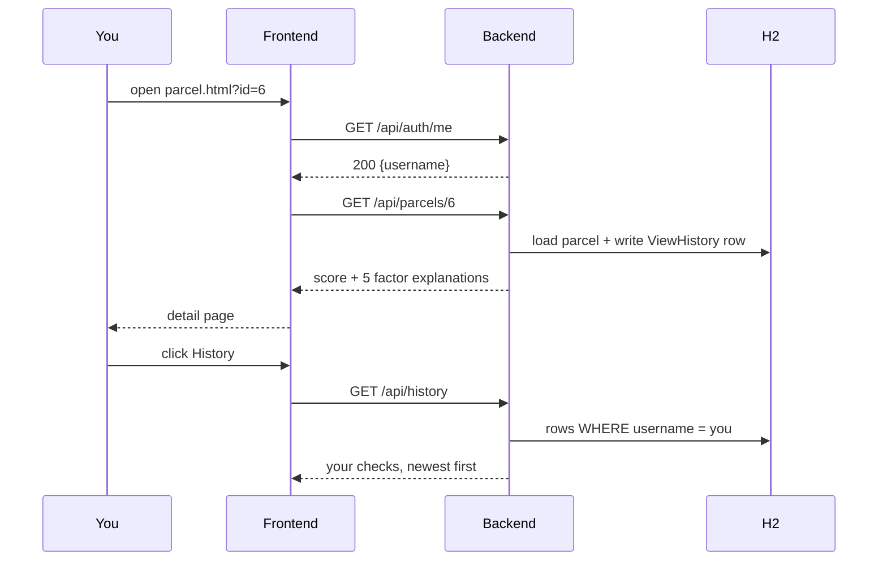

<h1 align="center">🏡 Land Title Risk Scorer</h1>

<p align="center">
A full-stack Java app that looks at a piece of land in Andhra Pradesh and gives it<br/>
a 0–100 "title risk score" — like a credit score, but for whether the paperwork is clean.
</p>

<p align="center">
<b>Backend:</b> Java 17 + Spring Boot 3 &nbsp;|&nbsp;
<b>Frontend:</b> plain HTML/CSS/JavaScript &nbsp;|&nbsp;
<b>Database:</b> H2 (in-memory, zero setup)
</p>

---

## Table of contents

1. [What is this, really?](#1-what-is-this-really)
2. [Running it yourself](#2-running-it-yourself)
3. [Screens and how you move between them](#3-screens-and-how-you-move-between-them)
4. [The 5 things it checks (in plain English)](#4-the-5-things-it-checks-in-plain-english)
5. [How it works, step by step](#5-how-it-works-step-by-step)
6. [A worked example](#6-a-worked-example)
7. [Project structure, explained](#7-project-structure-explained)
8. [The design pattern behind the scoring](#8-the-design-pattern-behind-the-scoring)
9. [How accounts and history work](#9-how-accounts-and-history-work)
10. [Why rules instead of AI/ML](#10-why-rules-instead-of-aiml)
11. [API reference](#11-api-reference)
12. [Tech stack](#12-tech-stack)

---

## 1. What is this, really?

Before anyone buys a plot of land in India, a lawyer usually digs through five or
six government records to make sure the seller actually has the legal right to
sell it, and that nothing nasty is hiding in the paperwork (an old unpaid loan
against the land, a court case, etc.).

This app automates the *first pass* of that check. You feed it a parcel of land
(who's selling it, where it is, and the outcome of 5 standard checks), and it
gives back:

- **A single score from 0 to 100** — higher is safer, exactly like a credit score.
- **A plain-English reason for every point lost**, so the score isn't a black box.

It comes pre-loaded with 20 realistic sample parcels from around Andhra
Pradesh, so you can open it and start clicking around immediately — nothing to
configure, no database to install. There's also an **"Add a property"** page
where you can enter your own combination of the 5 checks and get a real,
live-computed score back — it runs through the exact same backend logic as
every seeded property, nothing about it is pre-canned.

The app sits behind a **login**, and every property you check is recorded in a
private, per-account **History** tab — see
[section 9](#9-how-accounts-and-history-work) for how that works.

> **Note on the "20 sample parcels":** these are fictional, made-up examples
> (survey numbers, names, and locations) written to demonstrate how the
> scoring works. They are not real property records.

## 2. Running it yourself

You need **Java 17** installed. You do **not** need Maven installed — this
project bundles a Maven wrapper that downloads the right version for you
automatically the first time you run it.

**Step 1 — Clone the repository**

```bash
git clone https://github.com/sriram32086/land-title-risk-scorer.git
cd land-title-risk-scorer
```

**Step 2 — Run it**

| OS | Command |
|---|---|
| Windows | `mvnw.cmd spring-boot:run` |
| Mac / Linux | `./mvnw spring-boot:run` |

The first run takes a minute or two while it downloads Maven and the Java
libraries the project depends on — that only happens once.

**Step 3 — Open it**

Once the terminal prints `Started TitleRiskScorerApplication`, open:

👉 **http://localhost:8080**

To stop it, go back to the terminal and press `Ctrl+C`.

**Step 4 — Sign in**

The app is behind a login. A demo account is created on every startup so you
don't have to register first:

| Username | Password |
|---|---|
| `demo` | `demo1234` |

Or click **Create an account** on the login page to register your own — your
History tab is private to whichever account you're signed in as.

**Optional — look at the raw database.** While the app is running, open
[http://localhost:8080/h2-console](http://localhost:8080/h2-console) — JDBC
URL `jdbc:h2:mem:titleriskdb`, username `sa`, password blank. It's an
in-memory database, so every restart resets it back to the same 20 sample
parcels — nothing you do here can break anything permanently.

## 3. Screens and how you move between them

There are seven pages. This is the whole app:



| Page | What it's for |
|---|---|
| `index.html` | Branded intro animation. Auto-advances to the login page; has a Skip link. Purely cosmetic — it is **not** a security gate. |
| `login.html` | Sign in. Redirects straight to the dashboard if you already have a valid session. |
| `register.html` | Create an account. Signs you in automatically on success. |
| `dashboard.html` | The main screen: summary stats plus a table of every property and its score. |
| `parcel.html` | One property: score gauge, the record itself, a weighted breakdown bar, and a card per check. Visiting it records a History entry. |
| `add.html` | Enter your own five check outcomes and get a live score. |
| `history.html` | Every property *you* have checked, most recent first. |

## 4. The 5 things it checks (in plain English)

Each of these is a real category of due diligence used when buying land in
India. If any of these terms are new to you, here's the plain-language version:

| # | Factor | Weight | What it actually means |
|---|---|---|---|
| 1 | **Encumbrance Certificate (EC)** | 30% | A government-issued document listing every loan, mortgage, or legal claim ever registered against this exact piece of land. If it's "flagged," there's an old unresolved claim still attached to the land — and that claim follows the *land*, not the seller, so a buyer inherits it. |
| 2 | **Litigation status** | 25% | Is anyone currently suing over this land, or has a court case been filed? If yes, the property is called **"sub judice"** — a court could freeze the sale or even undo it later, no matter how clean everything else looks. |
| 3 | **Layout approval** | 20% | If the land is part of a residential layout (plots, roads, etc.), has the relevant government planning authority actually approved that layout? Andhra Pradesh doesn't have one single authority for this — it's **CRDA** near the new capital (Amaravati), **VMRDA** around Visakhapatnam, or **DTCP** elsewhere. An unapproved layout can block future construction permits. |
| 4 | **AP RERA registration** | 15% | RERA is an Indian law that requires real estate *projects being sold to the public* to register with the state regulator. It gives buyers legal recourse if the builder doesn't deliver. A plain resale of agricultural land doesn't need this — only actively marketed projects do. |
| 5 | **MeeBhoomi digital record match** | 10% | MeeBhoomi is Andhra Pradesh's official website where land records are stored digitally. This check asks: does the paper deed match what the government's own database says? A mismatch is usually a data-entry slip, not fraud, but it has to be fixed before registration. |

The weights (30/25/20/15/10) add up to 100% and reflect how much legal weight
each check actually carries in practice — the EC and litigation status matter
far more than a website data-entry mismatch.

## 5. How it works, step by step

Nothing here is magic — here's the exact sequence of events from the moment
you open the app to seeing scores on screen:



Click into any row and the same thing happens again for that one parcel, with
the full breakdown of all 5 factors instead of just the total.

The important part: **the backend and frontend only ever talk in JSON.** The
backend has no idea what the page looks like — it just answers questions like
"what's parcel #7's score?" The frontend is just JavaScript asking those
questions and drawing the answer on screen. This is exactly how a mobile app
would talk to the same backend, too.

## 6. A worked example

Let's score one real parcel from the seeded data by hand, so you can see
there's no hidden logic — it's just multiplication and addition.

**Parcel `19/2` — Machilipatnam, Krishna:**

| Factor | Status | Raw score (0–100) | Weight | Contribution |
|---|---|---|---|---|
| Encumbrance Certificate | Flagged | 15 | × 0.30 | 4.5 |
| Litigation | Active court case | 5 | × 0.25 | 1.25 |
| Layout approval | Unapproved | 10 | × 0.20 | 2.0 |
| AP RERA | Not registered | 30 | × 0.15 | 4.5 |
| MeeBhoomi match | Mismatch | 25 | × 0.10 | 2.5 |
| | | | **Total** | **14.75 → rounds to 15** |

That "15" is exactly what you'll see on the list page for that parcel — red,
because it's under 40. Open its detail page in the running app and you'll see
these same 5 numbers, plus the plain-English reason behind each one.

## 7. Project structure, explained

This is one Maven project, but it does two distinct jobs: a Java backend that
computes scores, and a plain-JS frontend that displays them. To keep that
clear, here they are as two separate diagrams instead of one mixed tree.

### 7a. Backend — `src/main/java/com/titlerisk/`

Every request flows through these packages roughly top to bottom:

```
com.titlerisk
│
├── model/          The "nouns" of the app: Parcel (a plot of land), User (an
│                   account), ViewHistory (one recorded score check), plus the
│                   5 enums (EcStatus, LitigationStatus, …) which are fixed
│                   lists of allowed answers — an EC can only ever be CLEAN or
│                   FLAGGED, nothing else.
│
├── repository/      One interface per table (Parcel / User / ViewHistory).
│                   Talks to the database — you never write SQL here, Spring
│                   Data generates it from the method names.
│
├── service/         The "brain." RiskScoringService takes a Parcel and
│   └── factors/     produces a score by combining 5 independent checks. The
│                   factors/ subfolder has one small class per check (see
│                   section 8 for why it's split up this way).
│                   CustomUserDetailsService bridges User to Spring Security.
│
├── dto/              Shapes the backend's JSON requests and responses. Keeps
│                   the database structure (Parcel, User) separate from what
│                   actually goes out over the wire — no password hash can
│                   leak into a response, because no DTO has that field.
│
├── controller/       The only classes that know about HTTP:
│                   • ParcelApiController  — GET/POST /api/parcels
│                   • AuthController        — register / login / logout / me
│                   • HistoryApiController  — GET /api/history
│
└── config/           SecurityConfig — which routes need a session, BCrypt setup.
                    DataSeeder    — inserts the 20 sample parcels and the
                                     demo account on startup.
```

### 7b. Frontend — `src/main/resources/static/`

Plain files, no build step, no npm, served as-is by Spring Boot. One HTML file
and one JS file per screen, plus shared helpers:

```
static/
├── index.html  login.html  register.html  dashboard.html
├── parcel.html  add.html  history.html
├── css/style.css      one stylesheet, shared by every page
└── js/                one file per page, plus common.js
```

`js/common.js` holds everything the pages share: `requireAuth()`, the top nav
bar, the SVG icon set, and the plain-English factor glossary. Every other JS
file drives exactly one page:

| Page | Its script |
|---|---|
| `index.html` (intro) | `js/intro.js` |
| `login.html` | `js/login.js` |
| `register.html` | `js/register.js` |
| `dashboard.html` | `js/dashboard.js` |
| `parcel.html` | `js/detail.js` |
| `add.html` | `js/add.js` |
| `history.html` | `js/history.js` |

### 7c. Everything else

| File | What it's for |
|---|---|
| `src/main/resources/application.properties` | App settings — port, database URL, etc. |
| `pom.xml` | Tells Maven which libraries this project depends on, and how to build it. |
| `mvnw` / `mvnw.cmd` | Lets you build/run the project without installing Maven yourself — see [section 2](#2-running-it-yourself). |

## 8. The design pattern behind the scoring

This is the part that's actually interesting from a software design point of
view, so it's worth walking through slowly.

**The naive way to write this** would be one big method with an if/else (or
switch) for every factor, something like:

```java
// what this project deliberately avoids:
double score = 0;
if (ec == CLEAN) score += 30; else score += 4.5;
if (litigation == NONE) score += 25; else if (litigation == PENDING) score += 12.5; ...
// ...and so on for all 5 factors, all tangled together in one method.
```

The problem: every time you add a 6th check (say, a boundary survey dispute),
you have to open this method and edit it, right next to four other checks
that have nothing to do with your change. It gets messy fast, and it's easy
to break an existing check by accident.

**What this project does instead:**

1. There's one shared contract, the `RiskFactor` interface:
   ```java
   public interface RiskFactor {
       double getWeight();
       FactorScore evaluate(Parcel parcel);
   }
   ```
2. Each check is its own small class that implements that contract —
   `EncumbranceFactor`, `LitigationFactor`, `LayoutApprovalFactor`,
   `ReraFactor`, `MeeBhoomiFactor`. Each one only knows about *its own* rule.
3. `RiskScoringService` never mentions any of those class names. It just asks
   Spring for "every class that implements `RiskFactor`," loops over whatever
   it gets, and adds up the weighted results:
   ```java
   public RiskScoringService(List<RiskFactor> riskFactors) {
       this.riskFactors = riskFactors; // Spring fills this in automatically
   }
   ```

The payoff: to add a 6th factor, you write **one new file** and mark it
`@Component`. Spring finds it automatically and `RiskScoringService` starts
including it in the total — without a single line of `RiskScoringService`
changing. In software design terms, this is the **Open/Closed Principle**:
the scoring engine is *open* to adding new checks, but *closed* to needing
modification when you do.

## 9. How accounts and history work

**Accounts.** Registration stores a username and a **BCrypt hash** of the
password — the plain-text password is never stored, logged, or returned by any
endpoint. Signing in creates an ordinary server-side session; the browser
holds a `JSESSIONID` cookie and sends it automatically on every later request,
so the frontend never has to manage a token.

**How pages are protected.** Static files (every `.html`, `css/`, `js/`) are
always servable — a browser must be able to load `login.html` before it can
log in. The real gate is on the data: every `/api/parcels/**` and
`/api/history/**` call requires a valid session. Each protected page calls
`requireAuth()` in `common.js` on load, which asks `GET /api/auth/me` and
bounces to `login.html` if that returns 401. So the app is secured at the API,
not by hiding HTML files.

**History.** Whenever a signed-in user opens `GET /api/parcels/{id}`, the
backend writes a `ViewHistory` row — username, which parcel, and a *snapshot*
of the score and risk band at that moment. Snapshotting is deliberate: History
is a record of what you saw when you checked it, not a live re-score, so the
History page never has to re-run the scoring engine to render a list.



Queries are always scoped to the session's own username, so there is no way to
read another account's history through the API.

## 10. Why rules instead of AI/ML

It would be possible to train a machine learning model to predict title risk
instead of hand-writing these rules. Two reasons that's the wrong tool here:

1. **There's no real training data.** Nobody has a spreadsheet of 10,000 real
   Andhra Pradesh parcels with a verified "this one turned out to be risky"
   label. Without real labeled outcomes, a model would just be fit to made-up
   numbers — which isn't actually more trustworthy than writing the rules
   directly, it just hides the guesswork behind a black box instead of
   stating it in the open.
2. **A due-diligence tool has to be explainable.** If a buyer's lawyer asks
   "why does this parcel score 24?", a rule-based answer — "the EC is
   flagged and there's an active lawsuit" — is something they can go verify
   against the actual government records. A machine learning model's
   internal weights can't be checked against a legal document the same way.

## 11. API reference

The backend is a plain JSON REST API. You can call it directly with `curl`,
Postman, or from any other app — it doesn't know or care that the bundled
frontend exists.

Everything except the auth endpoints requires a session, so with `curl` you
need a cookie jar:

```bash
# sign in once, keep the session in cookies.txt
curl -c cookies.txt -X POST http://localhost:8080/api/auth/login \
  -H "Content-Type: application/json" \
  -d '{"username":"demo","password":"demo1234"}'

# then send it with every later call
curl -b cookies.txt http://localhost:8080/api/parcels
```

<details>
<summary><b>Auth</b> — <code>POST /api/auth/register</code>, <code>/login</code>, <code>/logout</code>, <code>GET /api/auth/me</code></summary>

```bash
curl -X POST http://localhost:8080/api/auth/register \
  -H "Content-Type: application/json" \
  -d '{"username":"jane","password":"secret123"}'
```

All four return `{"username":"jane"}` on success (`/logout` returns an empty
200). Registering also signs you in, so there's no second login step.

| Situation | Status | Body `message` |
|---|---|---|
| Username under 3 chars | `400` | `Username must be at least 3 characters.` |
| Password under 6 chars | `400` | `Password must be at least 6 characters.` |
| Username already exists | `409` | `That username is already taken.` |
| Wrong username/password | `401` | `Invalid username or password.` |
| Calling `/me` with no session | `401` | `Not authenticated. Please log in.` |
</details>

<details>
<summary><b>History</b> — <code>GET /api/history</code></summary>

```bash
curl -b cookies.txt http://localhost:8080/api/history
```

```json
[
  {
    "id": 2,
    "parcelId": 9,
    "surveyNo": "45/2A",
    "locationArea": "Anandapuram, Visakhapatnam",
    "score": 46,
    "riskBand": "medium",
    "viewedAt": "2026-08-15T00:16:09.897025Z"
  }
]
```

Newest first, and always scoped to the signed-in account.
</details>

<details>
<summary><code>GET /api/parcels</code> — list every parcel with its score</summary>

```bash
curl -b cookies.txt http://localhost:8080/api/parcels
```

```json
[
  {
    "id": 1,
    "surveyNo": "142/2A",
    "sellerName": "K. Venkata Ramana Reddy",
    "locationArea": "Tullur, Guntur",
    "score": 100,
    "riskBand": "low"
  },
  { "...": "19 more rows" }
]
```

`riskBand` is `"low"` (score > 70, shown green), `"medium"` (40–70, yellow),
or `"high"` (< 40, red) — matches the color-coding in the UI.
</details>

<details>
<summary><code>GET /api/parcels/{id}</code> — full breakdown for one parcel</summary>

```bash
curl -b cookies.txt http://localhost:8080/api/parcels/1
```

```json
{
  "id": 1,
  "surveyNo": "142/2A",
  "sellerName": "K. Venkata Ramana Reddy",
  "locationArea": "Tullur, Guntur",
  "ecStatus": "CLEAN",
  "litigationStatus": "NONE",
  "layoutApproval": "APPROVED",
  "reraStatus": "REGISTERED",
  "meeBhoomiMatch": "MATCHED",
  "score": 100,
  "riskBand": "low",
  "factors": [
    {
      "factorName": "Encumbrance Certificate",
      "rawScore": 100.0,
      "weightPercent": 30,
      "explanation": "Encumbrance Certificate shows no registered liens, mortgages, or unresolved entries for this survey number — the strongest available evidence of a clean chain of title."
    },
    { "...": "4 more factors" }
  ]
}
```

Returns `404 Not Found` if the id doesn't exist.
</details>

<details>
<summary><code>POST /api/parcels</code> — add a new property and get its score back</summary>

```bash
curl -b cookies.txt -X POST http://localhost:8080/api/parcels \
  -H "Content-Type: application/json" \
  -d '{
    "surveyNo": "1/A",
    "sellerName": "Jane Doe",
    "locationArea": "Example Village, Guntur",
    "ecStatus": "CLEAN",
    "litigationStatus": "NONE",
    "layoutApproval": "APPROVED",
    "reraStatus": "REGISTERED",
    "meeBhoomiMatch": "MATCHED"
  }'
```

Returns `201 Created` with the same shape as `GET /api/parcels/{id}` — the
newly assigned `id` and its full computed score, ready to redirect to.

All 8 fields are required (every one of them feeds directly into the score).
A missing or blank field returns `400 Bad Request` with a plain-English reason:

```json
{ "status": 400, "error": "Bad Request", "message": "Survey number is required." }
```

This is exactly what powers the **Add a property** page — it's a thin HTML
form over this same endpoint, so anything you can do through the UI you can
also do with a script.
</details>

## 12. Tech stack

| Layer | Technology |
|---|---|
| Backend | Java 17, Spring Boot 3 (Spring Web, Spring Data JPA) |
| Auth | Spring Security — session-based login, BCrypt password hashing |
| Database | H2 (in-memory — no install, no setup) |
| Frontend | Plain HTML, CSS, and JavaScript (`fetch` API) — no framework, no build step, no npm |
| Icons | Hand-written inline SVG (no icon library, no emoji) |
| Build tool | Maven (wrapper included, so a local Maven install isn't required) |

---

<p align="center"><sub>Built as a portfolio project. Sample data is fictional.</sub></p>
